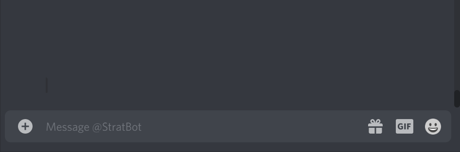

# stratbot
A discord bot for randomly picking strats for strat-roulette in CSGO.

The bot works by asynchronously querying an sqlite3 database which just contains about 100 different strategies.

**Add it to your own server via this [link!](https://discord.com/api/oauth2/authorize?client_id=721182707421544530&permissions=80896&scope=bot)**

## Command Usage
```!strat <side> [map=general] [pistols_only=False]```

Sends DM to user containing a random strategy.  For example, the command: ```!strat t de_dust2``` will result in the bot sending you a personal message with a random strategy for terrorists on dust 2




## Built with:
* [discord.py](https://github.com/Rapptz/discord.py)
* [aiosqlite](https://aiosqlite.omnilib.dev/en/latest/#)
